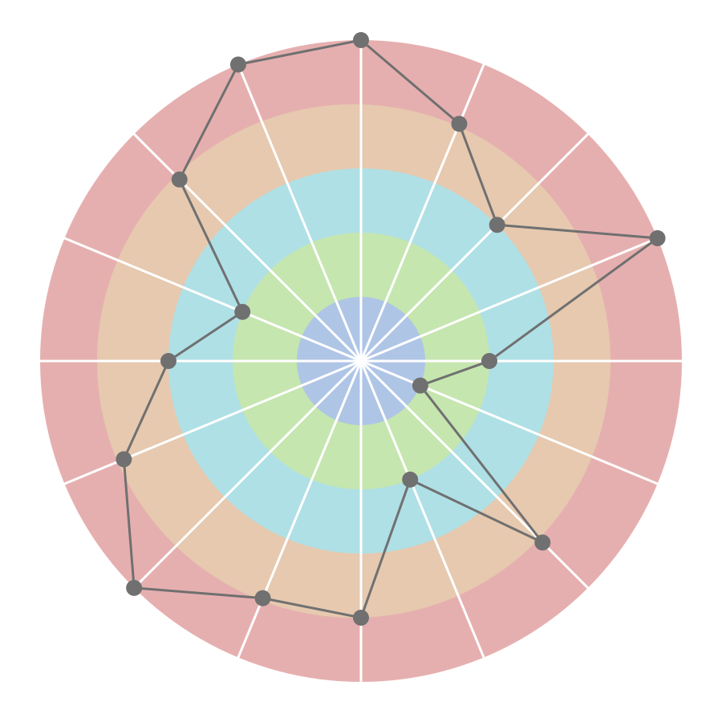

# svg_chart
Playing with SVG

## 目的

SVGと戯れたくなったので、遊んでみました。

## 何をしてるの

Pythonで動的にSVGレーダーチャートを生成します。

ゼロから書いたわけではなくAdobe XD でもとになるデザインを作成し、テンプレートとしてSVG出力しました。

d3.js とか使わないのという話がありますが、きわめて限られたタスクをサクッと終わらせるためにスクラッチで書いています。

## 使い方

- create_chart.py と同じ階層に score.txt を配置してください。
- score.txtには改行区切りで16個の1～5ポイントのスコアを記述してください。
- create_chart.py を実行してください。(pathの書き方などWindows環境用にしてます…。）
- スクリプトと同じ階層にSVGファイルが生成されるので、ブラウザやエディタで眺めて楽しんでください。